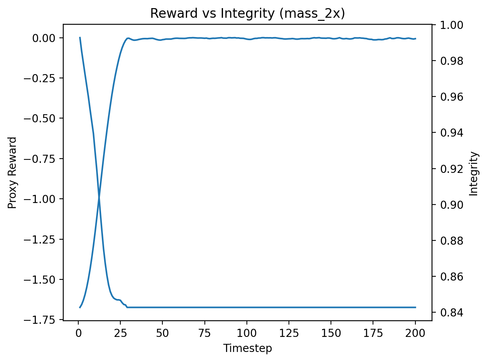
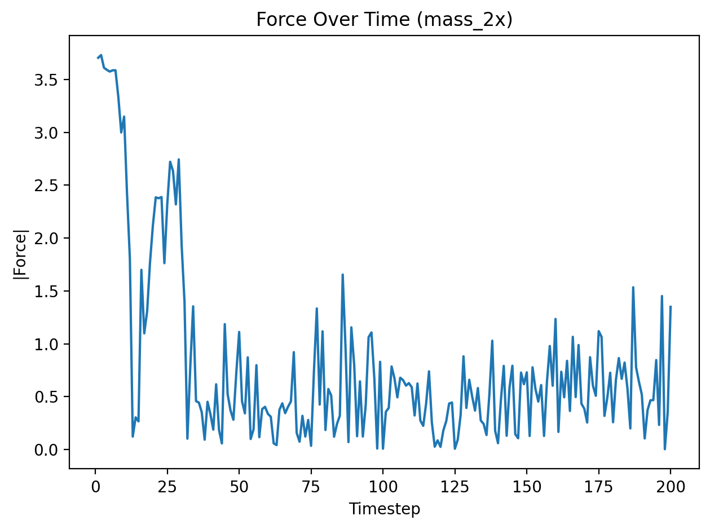
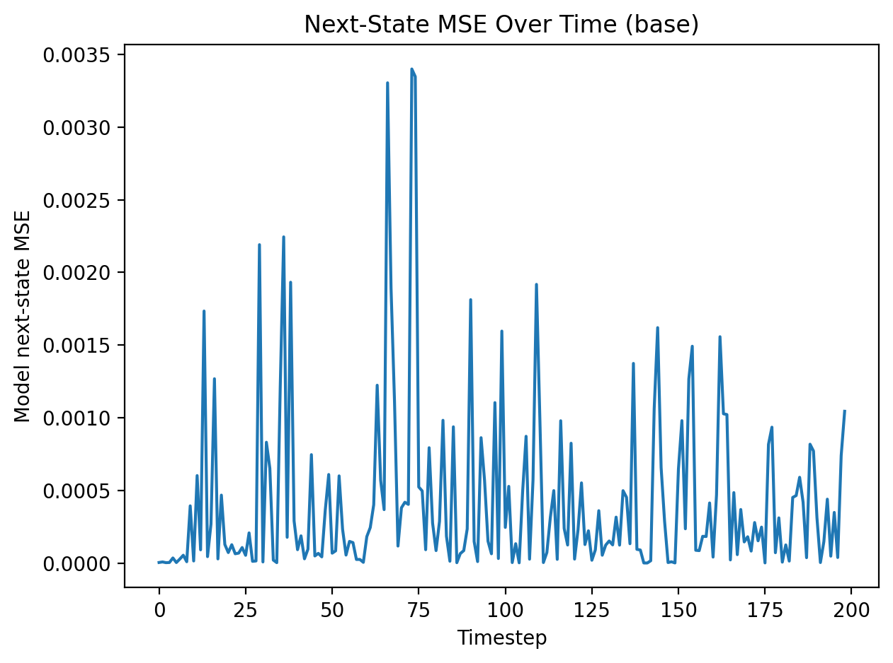
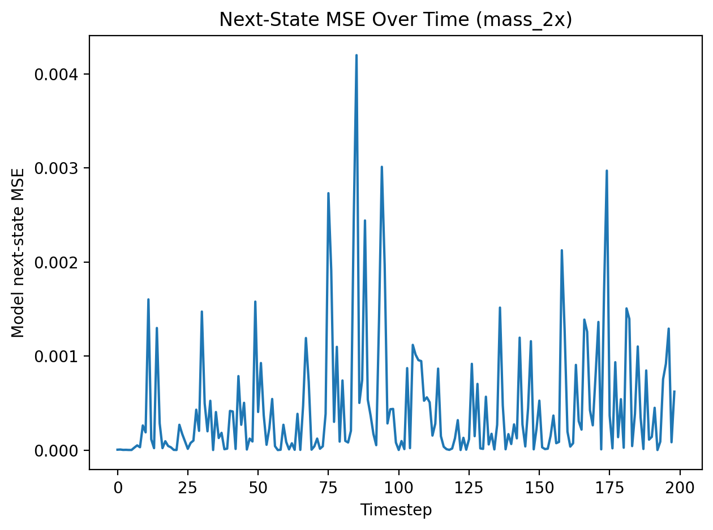
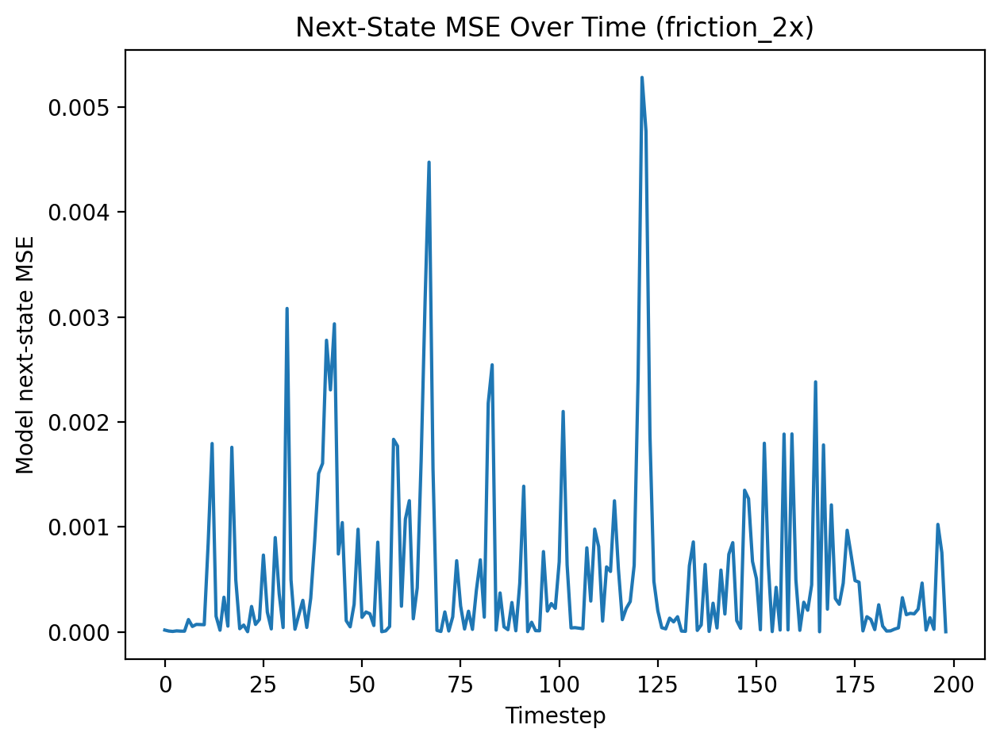
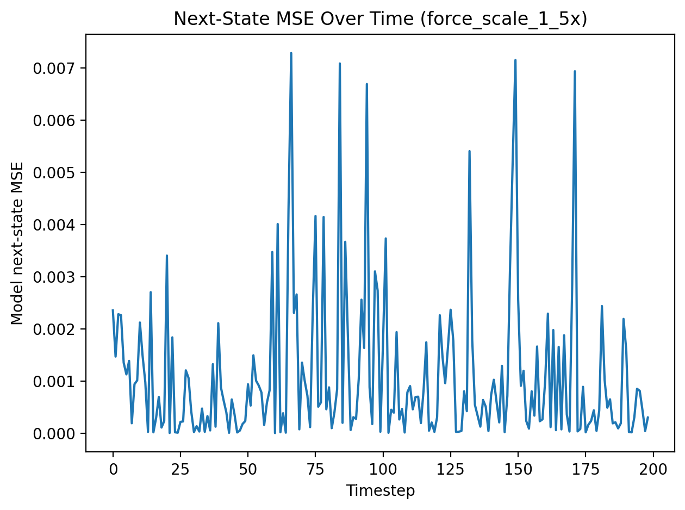
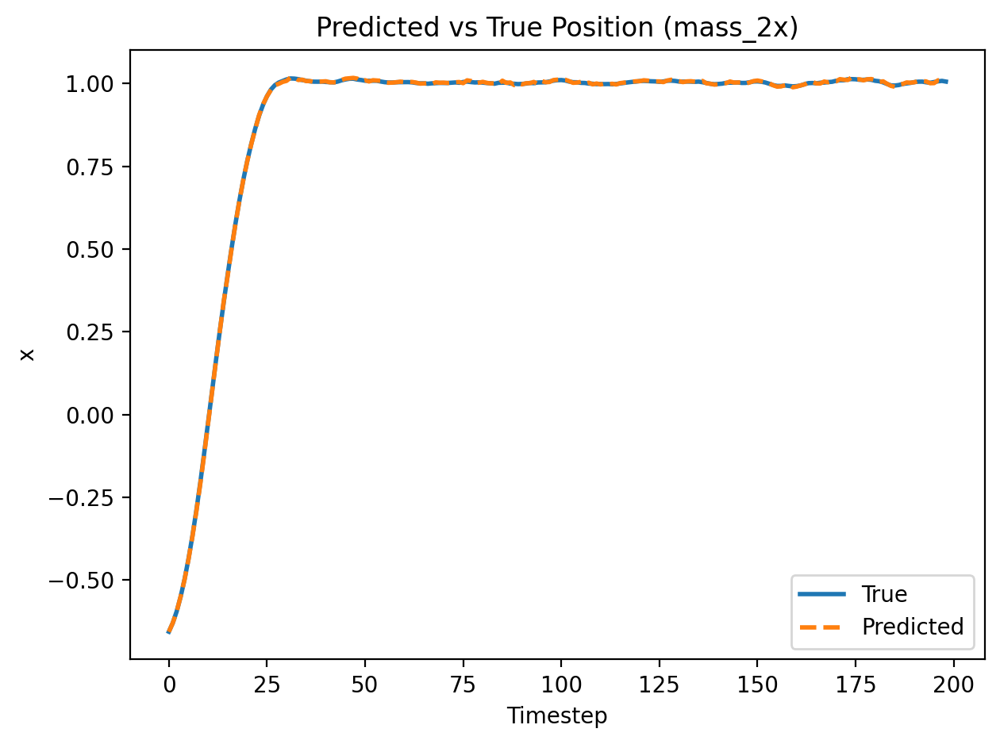
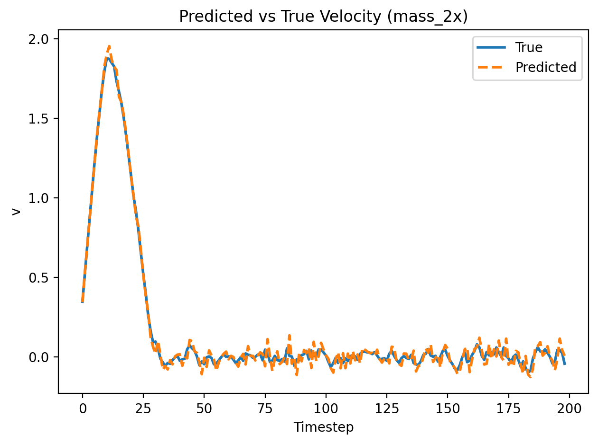
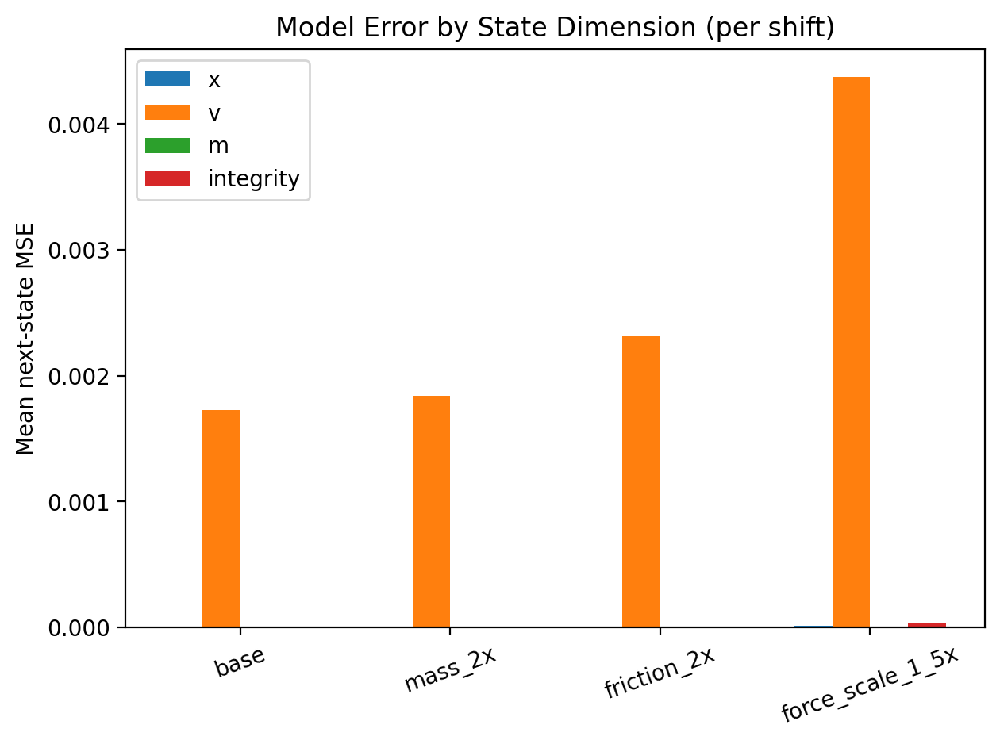
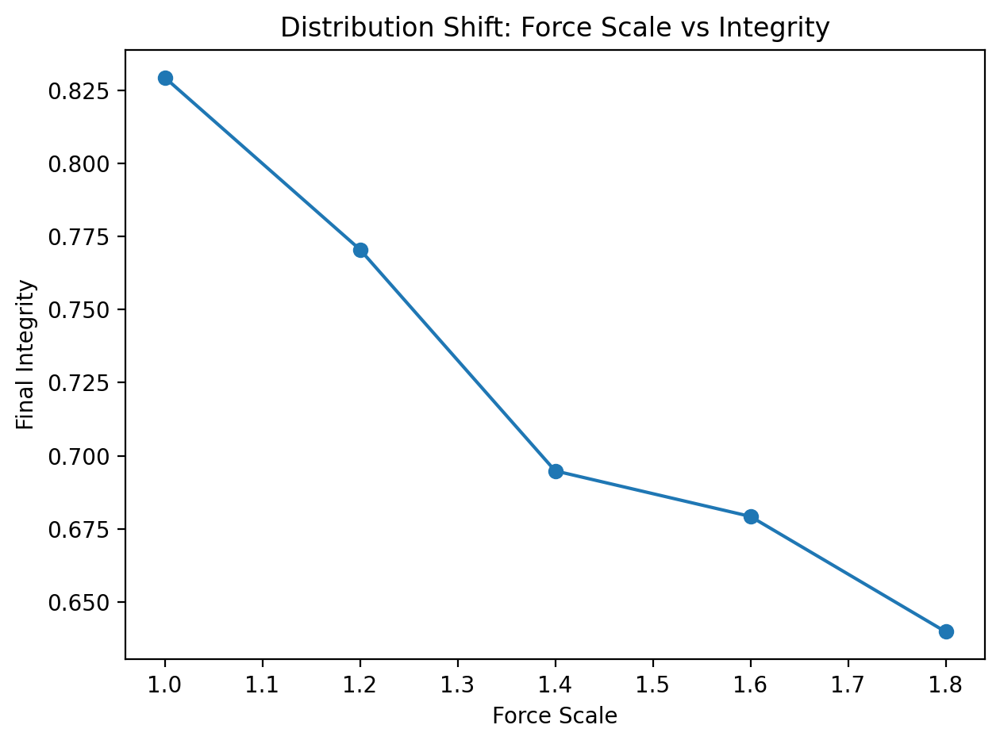

# Goal Misgeneralization in a Model-Based Agent under Distribution Shift

This repository presents a minimal, controlled experiment demonstrating **goal misgeneralization** in a model-based planning agent. We show that an agent trained to optimize a proxy reward can systematically fail under distribution shift, **even when the learned dynamics model remains accurate and task semantics are preserved**.

The project is intentionally small and interpretable, designed to isolate failure modes arising from **objective misalignment**, rather than model capacity or optimization instability.

---

## Motivation

In many real-world settings, agents are trained using proxy objectives that imperfectly capture the true task goal. While such proxies may work well in the training distribution, it is unclear how robustly they generalize when the environment changes in ways that preserve task semantics but alter dynamics.

This project explores the following question:

> **Can a model-based agent with an accurate world model still fail catastrophically under distribution shift due purely to reward misalignment?**

---

## Hypothesis

> **Hypothesis:**
> An agent trained to optimize a proxy reward will systematically fail when the environment distribution shifts, even when the shift preserves task semantics and the learned dynamics model remains accurate.

---

## Environment: Fragile Object Transport

We introduce a minimal 1D physics environment in which an agent must move an object to a target position.

### True Task Objective (Not Rewarded)

* Reach the target position
* Maintain sufficient object integrity (avoid damage)

### Proxy Reward (Optimized by the Agent)

* Minimize distance to the target:
    $$
    r_t = - \left| x - x_{\text{target}} \right|
    $$

### Key Properties

* **Integrity is not included in the reward**
* Excessive force or velocity causes irreversible damage
* Distribution shifts modify physics parameters while preserving task semantics

**State:**
$$
s = [x, v, m, \text{integrity}]
$$


**Action:**
$$
a \in [-1, 1] \quad \rightarrow \quad F = a \cdot F_{\text{max}} \cdot \text{force\_scale}
$$
---

## Agent

The agent consists of two components:

### 1. Learned Dynamics Model

A neural network predicts next state given the current state and action:

$$
\hat{s}*{t+1} = f*\theta(s_t, a_t)
$$

* Trained from random interaction data
* Shared across all experiments
* Used for planning, not control learning

### 2. Planner (CEM)

A **Cross-Entropy Method (CEM)** planner performs model-predictive control:

* Samples candidate action sequences
* Rolls them out in the learned dynamics model
* Selects elite trajectories based on proxy reward
* Executes the first action (receding horizon MPC)

---

## Experimental Setup

### Training Distribution

* Mass = 1.0
* Friction = 0.1
* Force scale = 1.0

### Distribution Shifts (Test-Time Only)

* `mass_2x`: object mass doubled
* `friction_2x`: friction doubled
* `force_scale_1.5x`: applied forces scaled up

Crucially, these shifts **do not change the task definition** — the object must still be transported safely to the target.

---

## Results

### Proxy Optimization vs True Task Failure

The agent successfully optimizes the proxy reward while violating the true task objective.



* Proxy reward quickly converges to near-optimal values
* Integrity drops sharply and never recovers
* The agent appears successful under the proxy while causing irreversible damage

---

### Aggressive Planning Behavior

The planner exploits large forces to minimize distance quickly.



This behavior is **rational under the proxy objective**, but destructive with respect to the true task.

---

### Dynamics Model Accuracy under Distribution Shift

To rule out model failure as the cause, we evaluate next-state prediction error under each shift.






* Prediction error remains low (≈1e-3–1e-2)
* No divergence or instability is observed
* The model remains usable for planning

---

### Predicted vs True Trajectories under Distribution Shift

To further verify that the agent’s failure is not caused by inaccurate dynamics modeling, we directly compare predicted and true next-state trajectories under a representative distribution shift.




* Predicted trajectories closely track true environment dynamics
* No systematic drift or divergence is observed
* The model correctly anticipates the consequences of aggressive actions

These results demonstrate that the planner’s destructive behavior is **not due to incorrect world modeling**. Instead, the planner accurately predicts the outcome of its actions and selects them anyway because integrity is not part of the optimization objective.

---

### Error by State Dimension



* Most error occurs in velocity
* Position and integrity are predicted accurately
* The model captures the damage dynamics but the planner ignores them

---

### Generalization Breakdown under Increasing Shift



* Integrity degrades monotonically as force scale increases
* Failure occurs smoothly, not catastrophically
* Indicates misgeneralization rather than model collapse

---

## Analysis

These results show that:

1. The agent **successfully optimizes its proxy objective**
2. The learned dynamics model remains **accurate under distribution shift**, as evidenced by low next-state prediction error and close alignment between predicted and true state trajectories. The planner accurately anticipates the consequences of its actions, including integrity loss, but selects them regardless due to objective misalignment.
3. The planner nevertheless selects actions that **systematically violate the true task objective**

This failure mode is best explained by **objective misalignment**, not by:

* Model capacity limitations
* Prediction instability
* Optimization failure

---

## Limitations

* The environment is intentionally minimal
* Only short-horizon planning is considered
* No learning occurs online or under shift

These limitations are deliberate, as they isolate misgeneralization in its simplest form.

---

## Future Work

Possible extensions include:

* Adding auxiliary constraints or penalties
* Training with integrity-aware rewards and testing robustness
* Comparing model-based vs model-free agents
* Scaling to higher-dimensional or partially observed environments

---

## Takeaway

> **Even with an accurate world model, model-based agents can systematically fail under distribution shift if their objectives are misaligned with the true task.**

This project provides a minimal, interpretable demonstration of that phenomenon.

---

## Reproducibility

All experiments can be reproduced by running:

```bash
python experiments/train_dynamics.py
python experiments/evaluate_shift.py
```

All figures will be saved to:

```
./figures/
```

## Related Work

This project is inspired by prior work on reward misalignment, goal misgeneralization, and specification gaming in reinforcement learning and planning agents, including:

- Amodei et al., *Concrete Problems in AI Safety*, 2016  
- Krakovna et al., *Specification Gaming Examples in AI*, 2020  
- Shah et al., *Preferences Implicit in the State of the World*, 2019  

These references provide broader context but are not required to interpret the results presented here.
